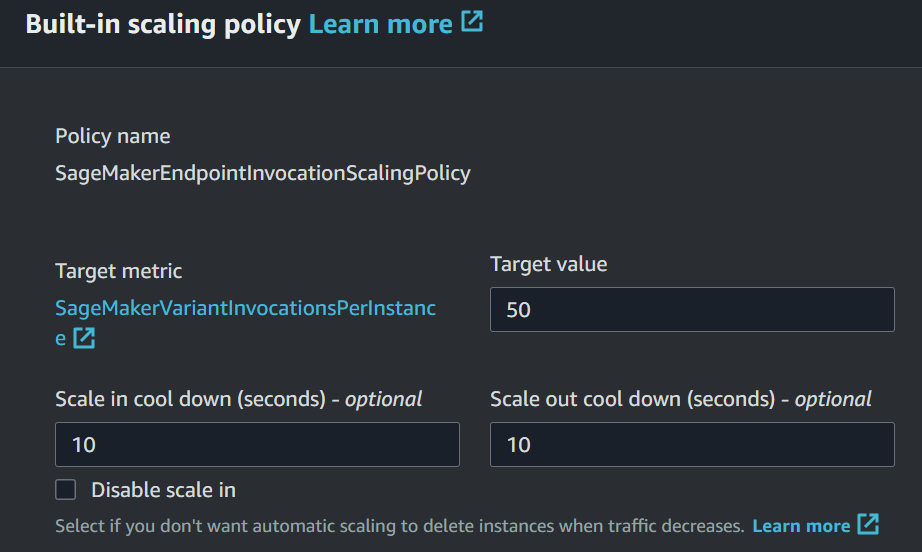

# Operationalizing an AWS ML Project

## Table of Content

- [Operationalizing an AWS ML Project](#operationalizing-an-aws-ml-project)
  - [Table of Content](#table-of-content)
  - [Setup \& Experiment](#setup--experiment)
    - [Upload data to an S3 bucket](#upload-data-to-an-s3-bucket)
    - [Hyperparameter tuning \& Training job](#hyperparameter-tuning--training-job)
    - [Deploy endpoint](#deploy-endpoint)
      - [Auto-scaling](#auto-scaling)
    - [EC2 Training](#ec2-training)
    - [Lambda Inference](#lambda-inference)
      - [Deploy and Test](#deploy-and-test)
      - [Concurrency](#concurrency)
    - [Security](#security)
      - [Required roles](#required-roles)
      - [Awareness and enhanced security](#awareness-and-enhanced-security)
  - [Future work](#future-work)


## Setup & Experiment

### Upload data to an S3 bucket

S3 path & all data folders

<p align="center">
    
</p>

<p align="center">
    
</p>

### Hyperparameter tuning & Training job

First we run the hyperparameter tuning job to get the best set of parameters for training and use **Test loss** as target metric. 

<p align="center">
    
</p>


Training with single instance (1) consumes about **12 minutes**

<p align="center">
    
</p>

Training with multi-instance (4) consumes about **13 minutes**, nearly the same as above.

<p align="center">
    
</p>

As we train with 4 isolated instances and use the default settings of **distributed options in S3(`FullyReplicated`)**. The training times are not changed and with each instance they have its own full dataset.

The central log shows all logs of 4 instances. There is only **one logstream** for single instance training.

<p align="center">
    
</p>

### Deploy endpoint

Deploy model endpoint with the best hyperparameters for inferences.

<p align="center">
    
</p>

#### Auto-scaling

Update "Endpoint Runtime settings"

<p align="center">
    
</p>

Configure "Variant automatic scaling", allow scaling in range from minimum of 1 to 3 instances.

<p align="center">
    
</p>

Configure "Built-in scaling policy" for automatic scaling based on the number of simultaneous invocations per instance (`SageMakerVariantInvocationsPerInstance`). This metric is defined by AWS in `Metric` in `Cloudwatch`. 

<p align="center">
    
</p>

**Explain:** 
- Those configured figure are reasonable for this context that could handle enough invocations at the same time. The cool down for both scale-in and scale-out are **30 seconds** for quick deploys and reduct downtime when an auto-scaling event is triggered; therefore, we can minimize the redundant unused instances or horizontally increase the performace when heavy workload comes in,  
- The threshold of **50** invocations and **3** for the maximum number of scaling instances is  are suitable for this scenarios, we can have a quick test to examine our endpoint.

### EC2 Training

Set up an Deep Learning OSS AMi EC2 instance for training task

<p align="center">
    
</p>

As the image illustrated, the support instance type only supports for some specific generations. From my perspectives, `g5.xlarge` is suitable for miminal requirements, the lowest type in G5 series: `4vCPU` - `16GB` RAM.

After creating instance, we have to activate the environment built on conda. This AMI include pytorch's necessary libraries

```bash
source activate pytorch
```

Prepare data and folder structure for directly training on this instance

```bash
wget https://s3-us-west-1.amazonaws.com/udacity-aind/dog-project/dogImages.zip
unzip dogImages.zip
mkdir TrainedModels
wget raw.github -O solution.py
```

Folders and files before training:

<p align="center">
    
</p>

Training and saving model. 
> Note: No log or print function are used so there is not much output.
> Note: We can use latest weight of pretrained model for achieving better performance (only on new pytorch version)

<p align="center">
    
</p>

Confirm model is saved. It's about `92MB` in size.

<p align="center">
    
</p>

Let's **compare to training on Jupyter notebook**, which training process occurs on Sagemaker instance's environment; we have specified python and framework versions in `Estimator`. The main differences are in the code, comes with the following reason

Code for EC2 instance:

- Minimal settings => For testing environment if we can run training job with customized flags
- No printed or informative logs
- Low value of `epochs` for quick training process
-  A notable piece of code

```python
with torch.no_grad():
    for pos,(inputs, labels) in enumerate(image_dataset[phase]):
        tot=len(image_dataset[phase])
        outputs = model(inputs)
        valid_loss = criterion(outputs, labels)
```

This code stop updating gradient for validation phase, which is particularly useful during validation and inference because it reduces memory consumption and speeds up computation. Since gradients are not needed when validating the model, using `torch.no_grad()` makes the process more efficient.

- Parameter: Parameters are passed statically in code (i.e `batch_size`) so we find it convenient for quick train and testing. Our goal is to see the model output and completed process of training

Code for Sagemaker instance: 

- Detailed and painstaking setting => Production environment
- Print valueable logs => Easier to centralize logs on **CloudWatch**
- High value of `epochs` for better precision
- Update the gradient in validation phase, no skipping
- Parameter: Parameters are passed dynamically through **environment variable** like `SM_CHANNEL_TRAINING` or `SM_MODEL_DIR` defined by Sagemaker. We follow the conventions made by AWS


### Lambda Inference

#### Deploy and Test

Deploy the Lambda function with `lambdafunction.py`. 
- **Python 3.8** for environment.
- **x86_64** for architecture

Permissions and roles

<p align="center">
    
</p>

Then create a payload for testing

<p align="center">
    
</p>

Test the created payload

<p align="center">
    
</p>

The output logs show the perfomance and consumed resources. The total amount of time including our called API, response + inferencing time of model is **1135.76 ms** and spend **77 MB** at peak

<p align="center">
    
</p>

The final predict result are the probability of **133 labels of dog breed** and can be refered at [this file](predicted_image_result.txt)

#### Concurrency


### Security

#### Required roles

Here are the summary of roles used in this project

<p align="center">
    
</p>

`project04-dog-breed-classification-lambda-inference`

Permission:

<p align="center">
    
</p>

Trusted entities:

```json
{
    "Version": "2012-10-17",
    "Statement": [
        {
            "Effect": "Allow",
            "Principal": {
                "Service": [
                    "sagemaker.amazonaws.com",
                    "lambda.amazonaws.com"
                ]
            },
            "Action": "sts:AssumeRole"
        }
    ]
}
```

`project04-dog-breed-classification-jupyter-notebook`

Permission:

<p align="center">
    
</p>

Trusted entities:

```json
{
    "Version": "2012-10-17",
    "Statement": [
        {
            "Effect": "Allow",
            "Principal": {
                "Service": "sagemaker.amazonaws.com"
            },
            "Action": "sts:AssumeRole"
        }
    ]
}
```

#### Awareness and enhanced security

Current security settings:

- **FullAccess** for services that are used for specific role
- No redundant policies or roles are generated
- Avoid exposing **Access Key** and **Secret Key** when try to login aws via Jupyter Notebook. If running code on local machine, we should authenticate outside the notebook or via environment variables and all authenticating information stored in `~/.aws/credential`

↪ Workspace is not secure enough, it needs to be consolidated

Improve security settings:

- Principle of Least Privilege: Grant granular permission when using specific services. We should not use **FullAccess** mindset, we only grant determined **Actions** with relevant **Resources** that we are going to handle or process on it.
  For example: if our notebook instance has too many unnecessary permission, it may caused unintended deletion of S3 bucket or deployment of endpoint that triggers massive cost.
- Enable *S3 bucket versioning* and *Soft delete* if possible, prevent accidental deletions or modifications.
- Assign EC2 Instance profile if EC2 instance uses AWS services (not in this project)
- Also, secure the process when working with projects: Manage login users, user roles, key, password policy, ...


## Future work

> TODO: